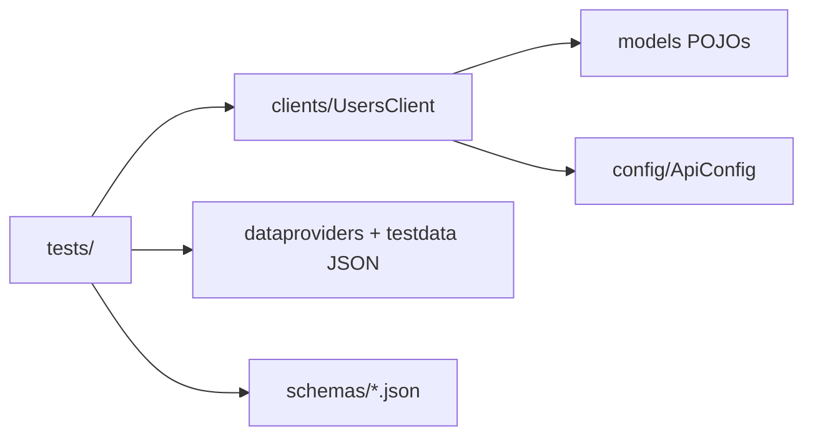

# API Automation — REST Assured (ReqRes)

[](https://github.com/SatyamChouksey-88/api-automation-restassured/actions/workflows/api-tests.yml)
[](https://openjdk.org/)
[](LICENSE)

**[▶ Live Allure report](https://satyamchouksey-88.github.io/api-automation-restassured/)**

Java 17 + REST Assured + TestNG suite against the public [ReqRes](https://reqres.in) API — CRUD, negative paths, JSON Schema validation, data-driven creates, and Allure on GitHub Pages.

## 1. Overview

ReqRes is a free fake REST API designed for testing. This portfolio repo demonstrates an enterprise-style Java API layer (client + POJOs + config) with TestNG orchestration, schema contracts, and CI-published Allure history — the Java/API gap many Playwright-only profiles leave empty.

## 2. Test coverage

Verified locally with `mvn test` (**17 tests, 0 failures**, 2026-09-24):

| Area | Tests | Type |
|---|---|---|
| Read (single + list) | 4 | Functional + JSON Schema (2 schemas) |
| Create | 4 | Data-driven POST (3 rows) + POJO round-trip |
| Update | 2 | PUT + PATCH |
| Delete | 1 | 204 |
| Negative | 3 | 404 user, register/login missing password |
| Auth happy path | 2 | Register + login token |
| List contract | 1 | `per_page` assertion |

## 3. Tech stack

Java 17 · Maven · TestNG · REST Assured · Jackson · JSON Schema Validator · Allure · GitHub Actions

## 4. Architecture



## 5. Design decisions

- **Client wrapper over raw RestAssured in every test** — URLs and content-type live in `UsersClient`; specs stay readable and DRY.
- **POJOs + Jackson NON_NULL** — create/update bodies serialize cleanly; PATCH can send only `job`.
- **JSON Schema for list + single user** — contract checks catch field renames without brittle full-body equality.
- **DataProvider from classpath JSON** — create cases come from `testdata/create-users.json`, not hardcoded loops in the test.
- **ReqRes over Restful Booker** — reachable from this environment (HTTP 200 on `/api/users/2`); no auth cookie dance required for CRUD demos.
- **Not automated:** real OAuth, pagination edge fuzzing beyond page 1–2, and load (owned by the JMeter portfolio repo).

## 6. Getting started

```bash
# Requires JDK 17+ and Maven 3.9+
mvn test
```

Override base URL if needed:

```bash
mvn test -DbaseUrl=https://reqres.in
```

## 7. CI/CD

| Trigger | Action |
|---|---|
| Push / PR / nightly cron | `mvn test` on Temurin 17 |
| Always (on main) | Build Allure report with history → publish `gh-pages` |

Workflow: [`.github/workflows/api-tests.yml`](.github/workflows/api-tests.yml)

## 8. Reports & evidence

- Allure results: `target/allure-results` after `mvn test`
- Live Pages report (after first green `main` deploy): https://satyamchouksey-88.github.io/api-automation-restassured/
- Screenshot of the Allure dashboard: *add after first Pages deploy if you want a README embed*

## 9. Roadmap / known limitations

- ReqRes is a mock API — create/update do not persist; tests assert response shape/status, not durable state.
- Public demos can rate-limit or change payloads; keep assertions on documented fields only.
- Optional next: WireMock for offline CI if ReqRes is unreachable.

## 10. Author & license

**Satyam Chouksey** — QA Automation Engineer / SDET  
MIT — see [LICENSE](LICENSE).
