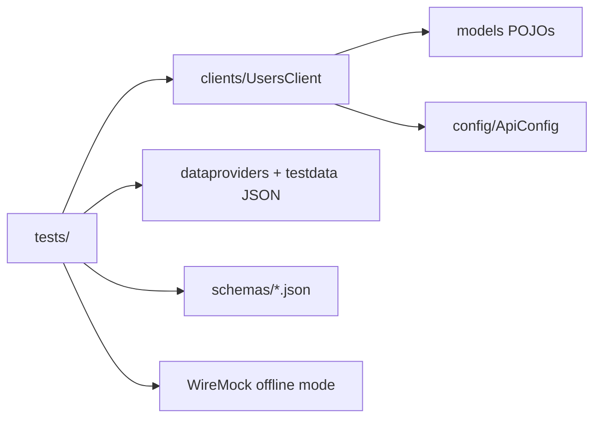

# API Automation — REST Assured (ReqRes)

[](https://github.com/SatyamChouksey-88/api-automation-restassured/actions/workflows/api-tests.yml)
[](https://openjdk.org/)
[](LICENSE)

**[▶ Live Allure report](https://satyamchouksey-88.github.io/api-automation-restassured/)**

Java 17 + REST Assured + TestNG suite against the public [ReqRes](https://reqres.in) API — CRUD, negative paths, JSON Schema validation, data-driven creates, pagination contracts, and Allure on GitHub Pages.

## 1. Overview

ReqRes is a free fake REST API for learning and demos. This repo shows an enterprise-style Java API layer (client + POJOs + config) with TestNG orchestration, schema contracts, optional `x-api-key` support, offline WireMock runs, and CI-published Allure history.

## 2. Test coverage

**25 TestNG tests** (23 methods + 2 extra data-driven create rows). CI runs the full suite against **live ReqRes** and again with **`-Dmode=mock`** (WireMock).

| Area | Tests | Type |
|---|---|---|
| Read (single + list) | 4 | Functional + JSON Schema (2 schemas) |
| Create | 4 | Data-driven POST (3 rows) + POJO round-trip |
| Update | 2 | PUT + PATCH |
| Delete | 1 | 204 |
| Negative / auth errors | 5 | 404 user, missing password/email, invalid login |
| Auth happy path | 2 | Register + login token |
| List & pagination contracts | 5 | `per_page`, `total_pages`, empty page, page ids, support block |
| Non-functional | 2 | Response time, `Content-Type` |

## 3. Tech stack

Java 17 · Maven · TestNG · REST Assured · Jackson · JSON Schema Validator · WireMock · Allure · GitHub Actions

## 4. Architecture


```mermaid
flowchart LR
  tests[tests/] --> client[clients/UsersClient]
  tests --> data[dataproviders + testdata JSON]
  client --> models[models POJOs]
  client --> config[config/ApiConfig]
  tests --> schemas[schemas/*.json]
  tests --> mock[WireMock offline mode]
```

## 5. Design decisions

- **Client wrapper over raw RestAssured in every test** — URLs, optional `x-api-key`, and content-type live in `UsersClient`.
- **POJOs + Jackson NON_NULL** — create/update bodies serialize cleanly; PATCH can send only `job`.
- **JSON Schema for list + single user** — contract checks catch field renames without brittle full-body equality.
- **DataProvider from classpath JSON** — create cases come from `testdata/create-users.json`.
- **Live vs offline** — default hits ReqRes; `-Dmode=mock` starts WireMock with ReqRes-shaped stubs (no network).
- **Optional API key** — `REQRES_API_KEY` env or GitHub secret when ReqRes requires `x-api-key`.
- **Not automated:** real OAuth, deep pagination fuzzing, and load (see the JMeter portfolio repo).

## 6. Getting started

```bash
# Requires JDK 17+ and Maven 3.9+
mvn test
```

Override base URL or run offline:

```bash
mvn test -DbaseUrl=https://reqres.in
mvn test -Dmode=mock
```

Optional ReqRes key (never commit):

```bash
export REQRES_API_KEY=your-key-from-app.reqres.in
mvn test
```

See `.env.example` for local env naming.

## 7. CI/CD

| Trigger | What runs | Report |
|---|---|---|
| Push / PR / nightly / manual | `mvn test` (live) + `mvn test -Dmode=mock` on Temurin 17 | Allure artifact |
| Push to `main` | Publish Allure with history | [GitHub Pages](https://satyamchouksey-88.github.io/api-automation-restassured/) |
| Push / PR | Gitleaks on full history | — |

Workflows: [api-tests.yml](.github/workflows/api-tests.yml), [secret-scan.yml](.github/workflows/secret-scan.yml)

## 8. Reports & evidence

- Local: `target/allure-results` after `mvn test`; open with `allure serve target/allure-results`
- **Live Allure:** https://satyamchouksey-88.github.io/api-automation-restassured/

## 9. Known limitations / roadmap

- ReqRes is a mock API — create/update do not persist; assertions target response shape/status.
- Public demos can rate-limit or change payloads; keep contracts on documented fields.
- Optional: banking-style synthetic FX validation repo (separate portfolio project).

## 10. Author & license

**Satyam Chouksey** — QA Automation Engineer / SDET · Bhopal, India  
MIT — see [LICENSE](LICENSE). All test data is synthetic; no employer or client data is used.
